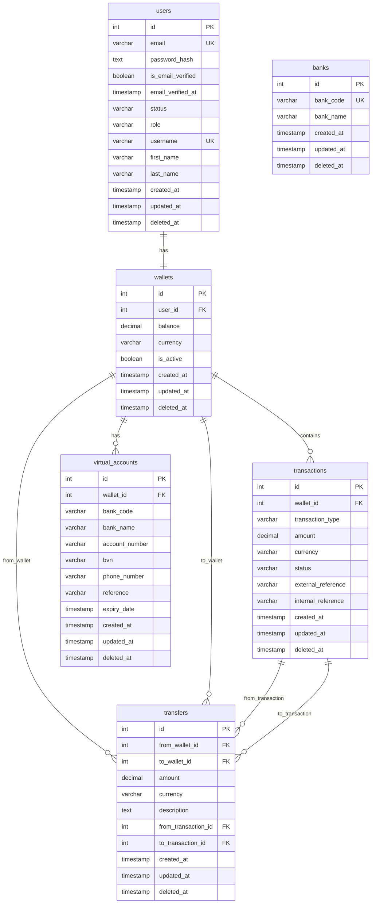

# Wendian Wallet Service

A comprehensive digital wallet service built with NestJS, providing secure financial transactions, user management, and blacklist verification through Lendsqr Adjutor Karma integration.

## 🚀 Features

- **User Management**: Secure user registration and authentication with email verification
- **Digital Wallet**: Create and manage digital wallets with NGN currency support
- **Fund Management**: Deposit funds via Flutterwave payment gateway integration
- **P2P Transfers**: Transfer funds between users using usernames
- **Withdrawals**: Withdraw funds to Nigerian bank accounts
- **Blacklist Protection**: Integration with Lendsqr Adjutor Karma for user verification
- **Transaction History**: Complete audit trail of all financial operations
- **Virtual Accounts**: Automated virtual account creation for seamless deposits

## 🏗️ Architecture

### Technology Stack

- **Backend**: NestJS (Node.js) with TypeScript
- **Database**: MySQL with Knex.js migrations
- **Payment Gateway**: Flutterwave integration
- **Queue Management**: BullMQ with Redis
- **Authentication**: JWT-based auth system
- **Validation**: Class-validator and custom decorators
- **Testing**: Jest with comprehensive unit tests
- **Cache**: Redis-based caching with Keyv
- **Email**: Nodemailer for email notifications

### Database Schema (ERD)



## 📦 Installation

### Prerequisites

- Node.js (v20+)
- MySQL (v8+)
- Redis (v7+)
- npm or yarn

### Environment Setup

1. Clone the repository:

```bash
git clone <repository-url>
cd wendian
```

2. Install dependencies:

```bash
npm install
```

3. Set up environment variables:

```bash
cp example.env .env
```

Configure the following variables in `.env`:

```env
# Database
DB_HOST=localhost
DB_USER=root
DB_PASSWORD=your_password
DATABASE=wendian_db
DB_PORT=3306
DB_SSL=false

# Redis
REDIS_HOST=localhost
REDIS_PORT=6379
REDIS_PASSWORD=
REDIS_TLS=false
REDIS_USERNAME=

# Flutterwave
FLW_PUBLIC_KEY=your_flutterwave_public_key
FLW_SECRET_KEY=your_flutterwave_secret_key
FLW_BASE_URL=https://api.flutterwave.com/v3

# Karma Service
KARMA_BASE_URL=https://api.lendsqr.com
KARMA_API_KEY=your_karma_api_key

# JWT
JWT_SECRET=your_jwt_secret
JWT_EXPIRES_IN=6000

# Mail Configuration
MAIL_HOST=smtp.gmail.com
MAIL_PORT=587
MAIL_USER=your_email
MAIL_PASS=your_password
MAIL_FROM=noreply@wendian.com
SEND_EMAIL=true

# App
NODE_ENV=development
PORT=3000
ORIGINS=http://localhost:3000,http://localhost:3001
```

4. Run database migrations:

```bash
npm run migrate:latest
```

5. Start the application:

```bash
# Development
npm run start:dev

# Production
npm run build
npm run start:prod
```

## 🔧 API Documentation

The API documentation is available at `/api/v1/docs` when the application is running.

### Consistent API Response Format

All API endpoints return responses in a standardized format for both success and error scenarios:

#### Response Structure

```typescript
{
  "isSuccessful": boolean,
  "data": T | null,
  "message": string,
  "code": number
}
```

#### Success Response Example

```json
{
  "isSuccessful": true,
  "data": {
    "id": 1,
    "email": "user@example.com",
    "firstName": "John",
    "lastName": "Doe",
    "username": "johndoe"
  },
  "message": "User profile retrieved successfully",
  "code": 200
}
```

#### Error Response Example

```json
{
  "isSuccessful": false,
  "data": null,
  "message": "User not found",
  "code": 404
}
```

#### Response Transformation

The application uses global interceptors and exception filters to ensure consistent response formatting:

**Response Interceptor**: Automatically wraps successful responses in the standard format
```typescript
@Injectable()
export class ResponseInterceptor<T> implements NestInterceptor<T, ApiResponseDto<T>> {
  intercept(context: ExecutionContext, next: CallHandler): Observable<ApiResponseDto<T>> {
    return next.handle().pipe(
      map((data) => new ApiResponseDto<T>(
        true,
        HelperService.keysToCamel(data) as T,
        message ?? 'Request successful',
        statusCode,
      ))
    );
  }
}
```

**Global Exception Filter**: Catches all exceptions and formats error responses consistently
```typescript
@Catch()
export class GlobalHttpExceptionFilter implements ExceptionFilter {
  catch(exception: unknown, host: ArgumentsHost) {
    const responseBody = new ApiResponseDto<null>(
      false,
      undefined,
      message,
      status,
    );
    
    res.status(status).json(responseBody);
  }
}
```

#### Key Features

- **Uniform Structure**: All endpoints follow the same response pattern
- **Automatic Transformation**: Responses are automatically formatted by interceptors
- **Error Handling**: Consistent error response format across all failure scenarios
- **camelCase Conversion**: All response keys are automatically converted to camelCase
- **HTTP Status Codes**: Standard HTTP status codes are preserved in the response

### Authentication Endpoints

#### Register User

```http
POST /api/v1/auth/register
Content-Type: application/json

{
  "email": "user@example.com",
  "firstName": "John",
  "lastName": "Doe"
}
```

#### Login User

```http
POST /api/v1/auth/login
Content-Type: application/json

{
  "email": "user@example.com",
  "password": "userPassword"
}
```

#### Verify Email

```http
POST /api/v1/auth/verify-email
Content-Type: application/json

{
  "email": "user@example.com",
  "otp": "123456"
}
```

#### Reset Password

```http
POST /api/v1/auth/reset-password
Content-Type: application/json

{
  "email": "user@example.com",
  "otp": "123456",
  "password": "newPassword"
}
```

### Wallet Endpoints

#### Create Wallet

```http
POST /api/v1/users/wallets
Authorization: Bearer <token>
Content-Type: application/json

{
  "bvn": "12345678901",
  "phoneNumber": "08012345678"
}
```

#### Fund Wallet

```http
POST /api/v1/wallet/fund
Authorization: Bearer <token>
Content-Type: application/json

{
  "amount": "1000.00"
}
```

#### Transfer Funds

```http
POST /api/v1/wallet/transfer
Authorization: Bearer <token>
Content-Type: application/json

{
  "toUsername": "recipient_username",
  "amount": "500.00",
  "description": "Payment for services"
}
```

#### Withdraw Funds

```http
POST /api/v1/wallet/withdraw
Authorization: Bearer <token>
Content-Type: application/json

{
  "amount": "200.00",
  "bankCode": "058",
  "accountNumber": "1234567890"
}
```

#### Verify Payment

```http
PATCH /api/v1/wallet/fund
Authorization: Bearer <token>
Content-Type: application/json

{
  "reference": "DEPOSIT_123456789"
}
```

### User Endpoints

#### Get Profile

```http
GET /api/v1/users/me
Authorization: Bearer <token>
```

#### Get Wallet

```http
GET /api/v1/users/wallets
Authorization: Bearer <token>
```

#### Search Users

```http
POST /api/v1/users/search
Authorization: Bearer <token>
Content-Type: application/json

{
  "page": 1,
  "size": 10
}
```

#### Update Username

```http
PATCH /api/v1/users/username
Authorization: Bearer <token>
Content-Type: application/json

{
  "username": "new_username"
}
```

### Utility Endpoints

#### Get Banks

```http
GET /api/v1/banks
```

#### Verify Bank Account

```http
POST /api/v1/account-verification
Content-Type: application/json

{
  "accountNumber": "1234567890",
  "bankCode": "058"
}
```

#### Get Dashboard Summary

```http
GET /api/v1/summary?fromDate=2023-01-01&toDate=2023-12-31
```

## 🧪 Testing

Run the test suite:

```bash
# Unit tests
npm run test

# Watch mode
npm run test:watch
```

## 🏢 Business Logic

### User Onboarding

1. **Registration**: Users register with email and basic information
2. **Email Verification**: Email verification process for account activation
3. **Karma Check**: Integration with Lendsqr Adjutor Karma to prevent blacklisted users from onboarding (production only)
4. **Wallet Creation**: Users can create a wallet with BVN and phone number verification

### Wallet Operations

#### Fund Wallet

- Users initiate funding through Flutterwave payment gateway
- Payment verification ensures transaction integrity
- Successful payments update wallet balance automatically

#### Transfer Funds

- P2P transfers between users using unique usernames
- Real-time balance validation prevents overdrafts
- Complete transaction audit trail maintained

#### Withdraw Funds

- Bank account verification before withdrawal processing
- Integration with Flutterwave for bank transfers
- Automatic reversal handling for failed transactions

### Transaction States

- **PENDING**: Initial transaction state
- **COMPLETED**: Successfully processed transaction
- **FAILED**: Transaction processing failed
- **CANCELLED**: User-initiated cancellation
- **REFUNDED**: Reversed transaction

## 🔒 Security Features

- **JWT Authentication**: Secure token-based authentication
- **Input Validation**: Comprehensive request validation using class-validator
- **SQL Injection Protection**: Parameterized queries with Knex.js
- **Rate Limiting**: API rate limiting for abuse prevention with Throttler
- **Blacklist Integration**: Real-time verification against Lendsqr Adjutor Karma
- **Transaction Locking**: Database row locking for concurrent transaction safety
- **Password Hashing**: Secure password hashing with PBKDF2

## 📊 Monitoring & Observability

- **Structured Logging**: Comprehensive application logging
- **Error Handling**: Centralized error handling with detailed error messages
- **Transaction Audit**: Complete transaction history and audit trails
- **Queue Monitoring**: BullMQ job queue monitoring

## ⚙️ Background Job Processing

The application uses BullMQ with Redis for reliable background job processing, particularly for transaction status verification and automated reconciliation.

### Transaction Status Monitoring

#### Funding Transaction Jobs

- **Payment Verification Job**: Automatically checks payment status with Flutterwave gateway
- **Retry Logic**: Failed verifications are retried with exponential backoff (max 10 attempts)
- **Balance Update**: Successful payments automatically credit user wallets
- **Notification**: Email notifications sent on transaction completion/failure

```typescript
@Processor('transactions')
export class TransactionsProcessor extends WorkerHost {
  private logger: Logger;
  constructor(private transactionService: TransactionsService) {
    super();
    this.logger = new Logger(TransactionsProcessor.name);
  }

  async process(job: Job) {
    switch (job.name) {
      case TransactionJobsEnum.VerifyWithdrawal: {
        const transferRef = job.data.transferRef;
        await this.transactionService.verifyWithdrawal(transferRef);
        break;
      }
      case TransactionJobsEnum.VerifyDeposit: {
        const reference = job.data.reference;
        await this.transactionService.verifyFunding(reference);
        break;
      }
    }
  }
}
```

#### Withdrawal Transaction Jobs

- **Bank Transfer Status**: Monitors bank transfer completion status
- **Reversal Handling**: Automatically reverses failed withdrawals to user wallets

#### Job Configuration

```typescript
// Job retry and delay configuration
await this.transactionsQueue.add(
        TransactionJobsEnum.VerifyDeposit,
        {
          reference,
        },
        {
          delay: ONE_MINUTE_IN_MS * 1,
          attempts: 10,
          backoff: {
            type: 'exponential',
            delay: ONE_MINUTE_IN_MS * 2,
          },
        },
      );
```

## 🚀 Deployment

### Docker Deployment

```bash
# Build image
docker build -f Dockerfile.staging -t wendian-wallet .

# Run with docker-compose
docker-compose up -d
```

### Environment-Specific Configurations

- **Production**: Karma verification enabled, optimized for performance
- **Testing**: In-memory database, mocked external services

### Database Migrations

```bash
# Run migrations
npx knex migrate:latest

# Rollback migrations
npx knex migrate:rollback

# Create new migration
npx knex migrate:make migration_name
```

## 📁 Project Structure

```
src/
├── app.module.ts              # Main application module
├── main.ts                    # Application entry point
├── auth/                      # Authentication module
├── common/                    # Shared utilities and services
│   ├── decorators/           # Custom decorators
│   ├── enums/               # Application enums
│   ├── services/            # Shared services
│   └── types/               # Type definitions
├── db/                       # Database layer
│   ├── entities/            # Database entities
│   ├── repositories/        # Data access layer
│   └── types/               # Database type definitions
├── mail/                     # Email service
├── transactions/             # Transaction handling
├── users/                    # User management
└── wallet/                   # Wallet operations
```

## 🛠️ Development Tools

- **ESLint**: Code linting with TypeScript support
- **Prettier**: Code formatting
- **Jest**: Testing framework
- **Swagger**: API documentation
- **Knex**: Database query builder and migrations
- **Class Transformer**: Object transformation
- **Class Validator**: Request validation

### Code Standards

- Follow TypeScript best practices
- Document API endpoints in Swagger

## 📄 License

This project is licensed under the MIT License - see the [LICENSE](LICENSE) file for details.

---

Built with ❤️ using NestJS and TypeScript
